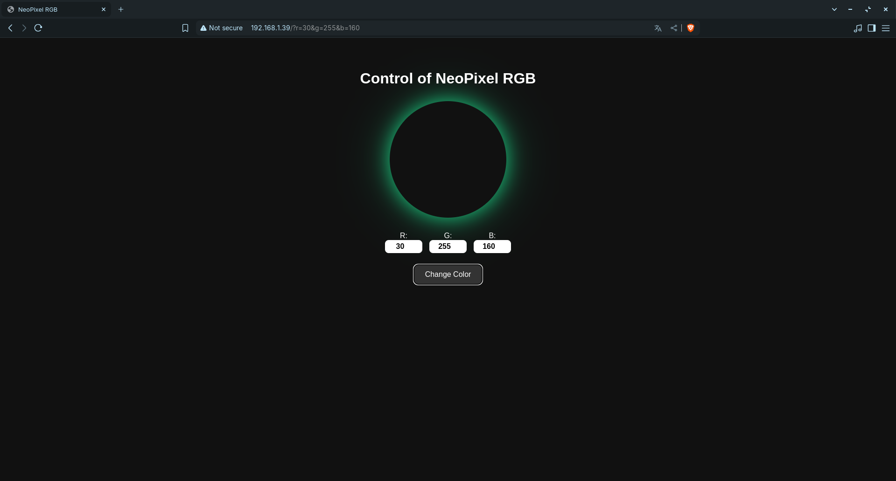
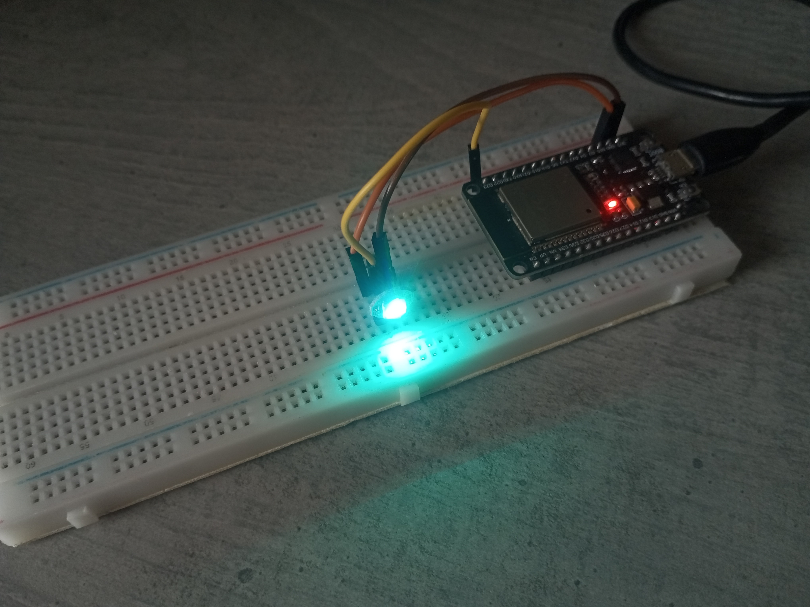

---

# 💡 RGB ESP32 Web Controller

This project allows you to control an **RGB LED (NeoPixel)** using an **ESP32** with an intuitive Web interface. Through numeric fields, you can adjust **red, green, and blue** values in real-time directly from your browser - no external apps needed.

---

## 📷 Demo

 
*Responsive interface accessible via ESP32’s local IP.*

---

## 🚀 Features

- Modern Web interface using embedded HTML, CSS, and JavaScript
- Wi-Fi RGB control with no cloud dependency
- Real-time brightness and color adjustment
- Compatible with all browsers (PC, mobile, tablet)
- Easily integrates into IoT and home automation projects

---

## 🧰 Requirements

- **ESP32** board (Dev Module or similar)
- **NeoPixel (WS2812)** LED or compatible RGB ring connected to GPIO 23
- Arduino IDE 1.8.19 or newer
- [Adafruit NeoPixel](https://github.com/adafruit/Adafruit_NeoPixel) library
- 2.4GHz Wi-Fi WPA2 connection

---

## 📦 Installation

1. Clone this repository:
   ```bash
   git clone https://github.com/pedrolucas7i/RGBESP32.git
   ```

2. Open `RGBESP32.ino` in the Arduino IDE.

3. Set up your Wi-Fi credentials:
   ```cpp
   const char* ssid = "YOUR_SSID";
   const char* password = "YOUR_PASSWORD";
   ```

4. Select your board:
   - **Board:** ESP32 Dev Module

   <br>

5. Upload the code to your ESP32.

---

## 🌐 Accessing the Web Interface

Once the ESP32 connects to Wi-Fi, its IP address will be shown in the Serial Monitor.  
Access that IP in your browser, for example:

```
http://<IP-GIVEN-ON-SERIAL-MONITOR-AFTER-CONNECTION>/
```


---

## 📷 Device


*Hardware used to make this project*


---

## 📁 Project Structure

```
📂 RGBESP32
 ├── RGBESP32.ino          # ESP32 source code
 ├── index_html            # Embedded HTML/CSS string (PROGMEM)
 └── README.md             # This file
```

---

## ⚙️ Customization

- You can modify the HTML layout in `RGBESP32.ino` to add sliders, presets, etc.
- The `index.html` file is provided for reference or standalone testing.
- RGB control logic can be extended to multiple LEDs or animated effects.

---

## 💡 Credits & Inspiration

- [Adafruit NeoPixel Library](https://github.com/adafruit/Adafruit_NeoPixel)
- Inspired by minimalist ESP32 IoT projects

---

## 📄 License

This project is licensed under the MIT License.  
Feel free to use, modify, and contribute!

---

🚀 Made with ❤️ by [Pedro Lucas](https://github.com/pedrolucas7i)

---
